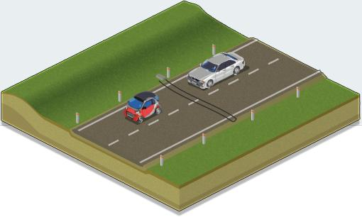
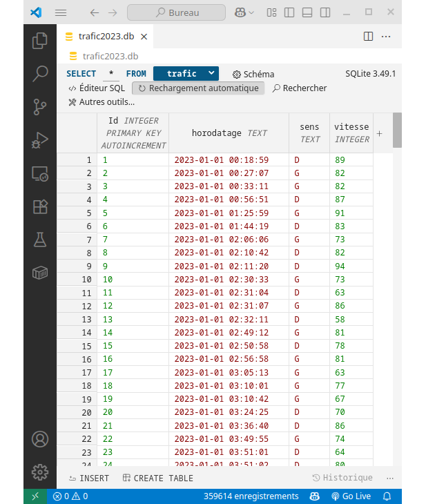
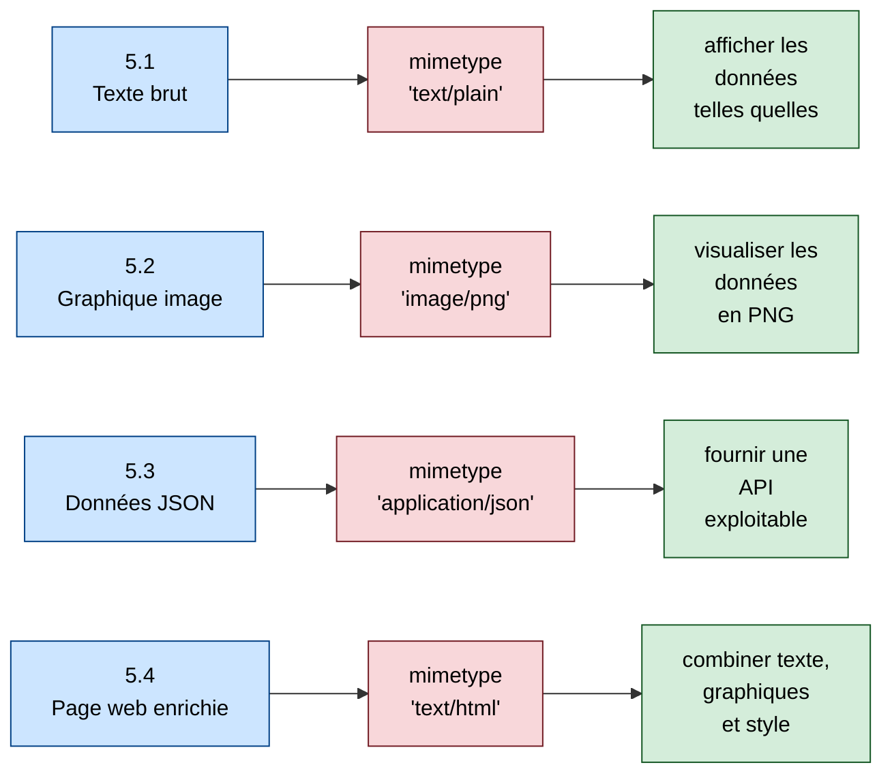
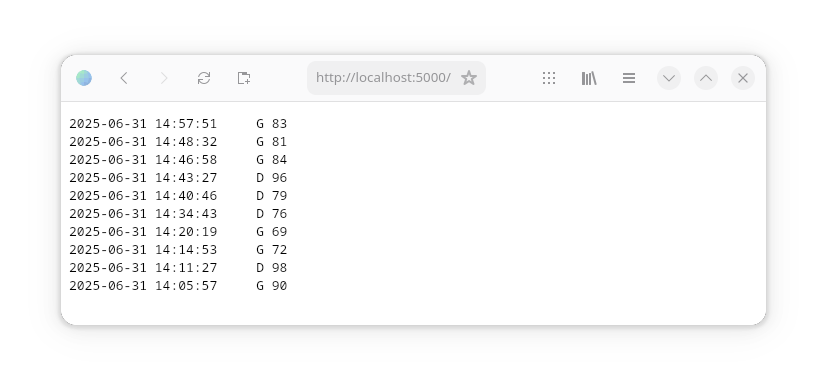
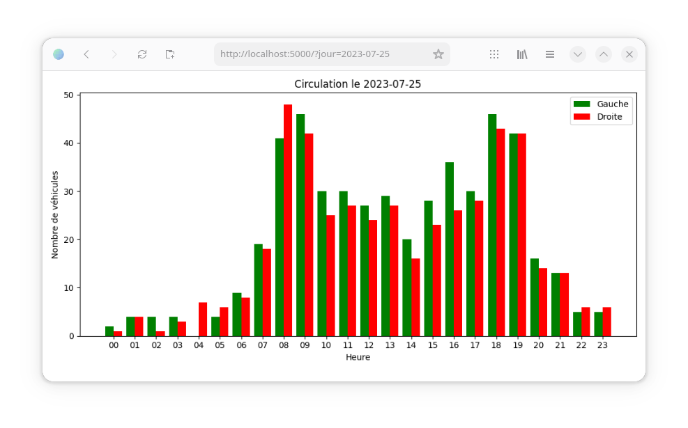
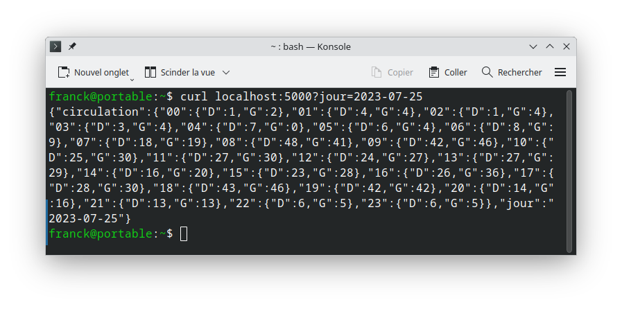

# Mini-projet : Système de comptage de véhicules



**Résumé :**

> On souhaite réaliser un système de comptage de véhicules qui détectera et comptabilisera le sens et l’heure de passage de chaque véhicule sur une route à double sens de circulation. Ces données seront captées au moyen d’une carte à microcontrôleur *Micro:Bit*, archivées dans une base de données *SQLite* (Faire le [TP d'introduction](tuto-sqlite.md)) et présentées au moyen d’un ordinateur sous forme d’une page Web accessible à distance.

## 🟢 ***Objectifs du mini-projet***

- Mettre en œuvre un système fonctionnant en réseau

- Réaliser une application fonctionnant en temps réel

## 🟢 ***Activités Professionnelles associées***

- Activité R2 : Installation et qualification

- Activité R4 : Gestion de projet et d’équipe

- Activité D2 : Développement et validation de solutions logicielles

## 🟢 ***Objectifs CIEL***

Le but de cette activité est de mobiliser les connaissances acquises en matière de développement logiciel tout en se préparant pour les épreuves du BTS CIEL.

Les compétences développées durant cette activité seront les suivantes :

- C01 :    COMMUNIQUER EN SITUATION PROFESSIONNELLE (FRANÇAIS/ANGLAIS)

- C02 :    ORGANISER UNE INTERVENTION

- C03 :    GÉRER UN PROJET

- C04 :    ANALYSER UN SYSTÈME INFORMATIQUE

- C05 :    CONCEVOIR UN SYSTÈME INFORMATIQUE

- C06 :    VALIDER UN SYSTÈME INFORMATIQUE 

- C08 :    CODER

## 🟢 ***Organisation***

### Le travail sera réalisé par 3 étudiants. L’un d’entre eux assurera la tâche de chef de projet en plus de la partie qu’il aura à réaliser. La répartition des tâches est à la charge des étudiants. Le développement se fera sur 3 semaines.

Les différentes parties sont :

- Acquisition du passage d’un véhicule

- Enregistrement dans une base de données **SQLite**, avec horodatage

- Présentation pour consultation à distance des données de passage des véhicules

- Analyse du fonctionnement des échanges entre la carte d’acquisition, l'ordinateur, et le réseau local

## 🟢 ***Travail à réaliser***

### Le groupe doit développer les aspects suivants :

- Installation/configuration matérielle et logicielle :
  
  - Carte *Micro:Bit*, utilisée pour récupérer les données du capteur (simulation par deux boutons-poussoirs)
    
    
  
  - Ordinateur du type *Raspberry Pi 400* pour héberger une base de données et une page web
    
    

- Acquisition/transmission des données de passage :
  
  - Les données de passage seront acquises par la carte *Micro:Bit* et transmises en temps réel à l’ordinateur

- Présentation pour consultation des données de passage :
  
  - Les données de passage de véhicules consultables via une page web hébergée sur la *Raspberry pi* 400 reliée au réseau

  - Une base de données *SQLite* permettra d'archiver les données
    
      [](https://sqlite.org/index.html)

- Analyse du fonctionnement des échanges :
  
  - L’échange de trames entre les différents éléments du système doit être analysé et présenté.

### La présentation orale (avec diaporama) doit comporter les éléments suivants :

- Présentation de l’objectif global

- Présentation des objectifs des différentes parties

- Présentation des réalisations des différentes parties du projet

## 🟢 ***Évaluation***

Chaque étudiant sera évalué **individuellement** à l’occasion des 10 min de l’exposé oral, mais aussi en tenant compte de la qualité des documents présentés.
Une attention particulière sera portée au **respect des points demandés** dans le travail à réaliser.

Durant la phase de mise au point, des **démonstrations pratiques** pourront être demandées.

---

## 🟢 ***Conseils pratiques et contraintes du projet***

### 🔵 1. Pour programmer :

- https://python.microbit.org/ (carte microbit)
- **Thonny** pour le code Python sur la raspberry 400 (déjà installé)

### 🔵 2. Utilisation des *boutons-poussoirs* de la carte *Micro:bit* :
   
   On simulera le passage d'un véhicule de la **gauche vers la droite** par un bref appui sur **A** suivi d'un bref appui sur **B**. Le passage d'un véhicule de la **droite vers la gauche** sera simulé par un bref appui sur **B** suivi d'un bref appui sur **A**. On transmettra alors une information représentant la vitesse, supposée **inversement proportionnelle** à l’intervalle de temps entre les deux appuis :
     
     > **V = 20000 / Δt** (avec V en km/h et Δt en ms)
   
      Par exemple, si un véhicule venant de la gauche roule à 83 km/h en passant sur le capteur, la carte *Micro:bit* transmettra la chaîne "`G83`" (suivie d'un saut de ligne).

   - On utilisera la *matrice de leds* pour indiquer le sens de passage du dernier véhicule détecté (**←** ou **→**)

### 🔵 3. Base de données *SQLite*
   
La base de données "trafic.db" ne contiendra qu'une table nommée "trafic" dont le *schéma*  est donné :

```sql
trafic (Id INTEGER PRIMARY KEY AUTOINCREMENT, horodatage TEXT, sens TEXT, vitesse INTEGER)
```

Vous pourrez travailler avec la base de données fictive [trafic2023.db](trafic2023.db) dont le début est illustré dans la capture d'écran ci-dessous (utilisation de l'extension *VS Code* [SQLite3 Editor](https://marketplace.visualstudio.com/items?itemName=yy0931.vscode-sqlite3-editor)) :



### 🔵 4. Restitution du trafic : Du texte brut au web enrichi

> Vous réaliserez successivement les 4 types de `restitution du trafic` présentés ci-dessous en vérifiant à chaque fois que les données sont bien consultables à distance avec un **navigateur** et/ou une **commande HTTP**.

#### Utilisation de Flask conseillée

Pour ce mini-projet, vous pouvez utiliser le micro-framework [*Flask*](https://flask.palletsprojects.com/).
*Flask* permet de créer facilement un petit serveur web qui renvoie des réponses HTTP (texte, images, JSON, pages HTML…).
C’est lui qui assurera la communication entre votre programme Python et l’utilisateur distant : à chaque requête envoyée par un client HTTP (navigateur, outil en ligne de commande, application, etc.), *Flask* enverra la réponse correspondante.
Ainsi, chacune des 4 restitutions du trafic (texte, graphique, JSON, page HTML) devra être réalisée via une route Flask.

#### Pourquoi utiliser Flask plutôt qu’Apache2 ?

Apache2 est un serveur web très puissant et largement utilisé, mais il est surtout conçu pour distribuer des fichiers déjà existants. Dans notre projet, nous avons besoin de générer dynamiquement différentes représentations du trafic (texte, graphiques, JSON, page HTML enrichie). C’est exactement ce que permet Flask, en programmant directement les réponses en Python.

#### Description des 4 restitutions



✔️ 4.1 *Dans un premier temps* : En affichant du **texte brut** (`mimetype="text/plain"`).

Voir la [définition](https://fr.wikipedia.org/wiki/Type_de_m%C3%A9dias) de `mimetype`.

> On pourra par exemple lister les 10 derniers passages de véhicules en indiquant pour chacun l'horodatage, le sens de circulation, et la vitesse (capture d'écran d'un navigateur, obtenue en utilisant le simulateur de trafic) :



Vérifiez que ces données sont accessibles depuis une autre machine sur le réseau, avec un navigateur web classique, un navigateur mode texte comme [`lynx`](https://lynx.invisible-island.net), et la commande [`curl`](https://www.it-connect.fr/curl-loutil-testeur-des-protocoles-div).

✔️ 4.2  *Dans un deuxième temps* : en affichant un graphique (`mimetype="image/png"`).

> Ici on a choisi de représenter le nombre total de véhicules sur une journée par tranches horaires et en indiquant le sens de passage à l'aide de barres de couleurs différentes (capture d'écran obtenue à partir de [trafic2023.db](trafic2023.db)) :



> *Remarque :* Le choix du jour est effectué par passage d'un paramètre `jour` dans l'URL par la méthode GET.

✔️ 4.3 *Dans un troisième temps* : en renvoyant la même information que le graphique précédent, mais au format [JSON](https://fr.wikipedia.org/wiki/JavaScript_Object_Notation) (`mimetype="application/json"`) , comme le ferait une [API](https://fr.wikipedia.org/wiki/Interface_de_programmation).

Résultat attendu (par exemple avec la commande `curl`) :



Ce qui donnerait une fois formaté (par exemple en faisant un [`tube`](https://fr.wikipedia.org/wiki/Tube_%28shell%29) vers la commande [`jq`](https://blog.stephane-robert.info/docs/admin-serveurs/linux/jq/)):

```json
{
  "circulation": {
    "00": { "D": 1, "G": 2 },
    "01": { "D": 4, "G": 4 },
    ...
    "23": { "D": 6, "G": 5 }
  },
  "jour": "2023-07-25"
}
```
> *Note :* Une API (Application Programming Interface) permet à un programme d'accéder à des données ou services. Lorsqu'elle utilise les règles du web (comme GET ou JSON), on parle souvent d'API REST.

Réalisez ensuite un client (en *Python*) qui demande à l’utilisateur une date au format AAAA-MM-JJ (AAAA doit obligatoirement être 2023 puisque la base de données utilisée est [trafic2023.db](trafic2023.db)). Le programme doit ensuite interroger l’API pour récupérer les données de circulation correspondantes, calculer le nombre total de véhicules (somme des sens G et D) pour chacune des quatre tranches horaires de 6 heures de la journée, et afficher clairement le total obtenu pour chaque tranche.

Résultat attendu :


✔️ 4.4 *Dans un quatrième temps* : en affichant une page **HTML** (`mimetype="text/html"`) avec :
- des données enrichies (texte et graphiques) comme :
  - vitesses moyennes dans les deux sens de circulation
  - pourcentage de véhicules dépassant une vitesse maximale autorisée
  - nombre de grands excès de vitesse
  - statistiques concernant le trafic en fonction du moment de la journée
  - etc.
- une feuille de style *CSS*
- passage de paramètres par GET (par exemple pour définir une période d'analyse)
- etc.
  
### 🔵 5. Exemple d'organisation matérielle et logicielle
   


- `capte_trafic.hex` : Captage des véhicules et transmission série via USB
- `ser2db.py` : acquisition des données de la carte *Micro:Bit* et mise à jour de la BDD
- `trafic.db` : base de données *SQLite*
- `db2web.py` : lecture de la BDD et confection de la page Web

> *note* :  
> `ser2db.py` et `db2web.py` peuvent être fusionnés dans un seul script Python (nommé par exemple `ser2db2web.py`) en utilisant du [*threading*](https://www.docstring.fr/glossaire/threading/).

### 🔵 6. Exemple de réalisation d'un projet du même type

#### Lien :  [Moniteur de température](microbit-serial-sqlite-web.md)

## 🟣 ***Pour aller plus loin...***

- Rendre le système complètement autonome en utilisant le principe des [services](https://fr.wikipedia.org/wiki/Daemon_(informatique)) (voir [cette page](https://www.malekal.com/creer-service-linux-systemd/)).

- Utiliser un [planificateur de tâches](https://www.linuxtricks.fr/wiki/cron-et-crontab-le-planificateur-de-taches) afin d'effectuer une sauvegarde journalière de la BDD :
  - sur le *Raspberry Pi 400* lui-même
  - sur une machine virtuelle *Debian* de votre poste de travail (via le réseau local)
  - dans le *cloud*
    
- Utiliser [*streamlit*](https://streamlit.io) à la place de *Flask* pour la partie 5.4.

- Exposer les résultats sur internet à travers un tunnel grâce à [*localhost.run*](https://localhost.run).
